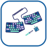
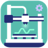

# Puneet Saini

**Senior software engineer. Serial tinkerer.**

Multi-agent AI systems for clean energy by day. Raspberry Pis, keyboards, a Klipper printer, and Japanese by night.

## Now

- Building **grid-readiness AI agents** with LangGraph that de-risk datacenter land acquisition.
- Running **[NewsDoggo](https://newsdoggo.com)**, an autonomous newshouse where AI agents write and publish the news every day.
- Shipping **[Cue](https://cue2.hstpowers.com)** and **[View](https://view2.hstpowers.com)**, the marketplace and portfolio platform behind solar projects.
- Tuning input shaping on a Kobra 2 Neo and drilling JLPT N5 kanji.

## Tools & toys

| | | |
|---|---|---|
|  | **[Pi Speakers](https://github.com/psa1302/pi_airplay)** | A Raspberry Pi feeding AirPlay 2, Spotify Connect, and Bluetooth to old speakers, with a themed LCD dashboard. |
|  | **[Corne keyboards](https://github.com/psa1302/zmk-config)** | Split keyboards I build and solder myself, running my ZMK firmware. |
|  | **[Kobra 2 Neo on Klipper](https://github.com/psa1302/klipper-config)** | Sensorless homing, measured input shaping, and macros for a heavily modified printer. |
|  | **[Stroke Practise](https://strokepractise.vercel.app)** | Kanji stroke-order practice that grades each stroke as you draw. |

## Stack

&nbsp;&nbsp;&nbsp;&nbsp;&nbsp;&nbsp;&nbsp;&nbsp;&nbsp;&nbsp;&nbsp;&nbsp;&nbsp;&nbsp;&nbsp;

