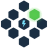
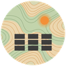

# Puneet Saini

**Senior software engineer. Serial tinkerer.**

Multi-agent AI systems for clean energy by day. Raspberry Pis, keyboards, a Klipper printer, and Japanese by night.

## Now

<table>
  <tr>
    <td width="56"></td>
    <td><b>Grid-readiness AI agents</b></td>
    <td>LangGraph agents that de-risk datacenter land acquisition, from grid data to diligence documents.</td>
  </tr>
  <tr>
    <td width="56"></td>
    <td><b><a href="https://newsdoggo.com">NewsDoggo</a></b></td>
    <td>An autonomous newshouse: AI agents collect, write, edit, and publish the news every day.</td>
  </tr>
  <tr>
    <td width="56"></td>
    <td><b><a href="https://cue2.hstpowers.com">Cue</a></b></td>
    <td>Marketplace matching solar developers with landowners, and datacenters with clean energy.</td>
  </tr>
  <tr>
    <td width="56"></td>
    <td><b><a href="https://view2.hstpowers.com">View</a></b></td>
    <td>Solar project portfolio platform with maps, KML, and weather data.</td>
  </tr>
  <tr>
    <td width="56"></td>
    <td><b>Solar platform services</b></td>
    <td>Energy market models, layout optimisation, and GIS analysis behind View.</td>
  </tr>
</table>

After hours: input shaping on a Kobra 2 Neo and JLPT N5 kanji.

## Tools & toys

<table>
  <tr>
    <td width="56"></td>
    <td><b><a href="https://github.com/psa1302/pi_airplay">Pi Speakers</a></b></td>
    <td>A Raspberry Pi feeding AirPlay 2, Spotify Connect, and Bluetooth to old speakers, with a themed LCD dashboard.</td>
  </tr>
  <tr>
    <td width="56"></td>
    <td><b><a href="https://github.com/psa1302/zmk-config">Corne keyboards</a></b></td>
    <td>Split keyboards I build and solder myself, running my ZMK firmware.</td>
  </tr>
  <tr>
    <td width="56"></td>
    <td><b><a href="https://github.com/psa1302/klipper-config">Kobra 2 Neo on Klipper</a></b></td>
    <td>Sensorless homing, measured input shaping, and macros for a heavily modified printer.</td>
  </tr>
  <tr>
    <td width="56"></td>
    <td><b><a href="https://strokepractise.vercel.app">Stroke Practise</a></b></td>
    <td>Kanji stroke-order practice that grades each stroke as you draw.</td>
  </tr>
</table>

## Stack

&nbsp;&nbsp;&nbsp;&nbsp;&nbsp;&nbsp;&nbsp;&nbsp;&nbsp;&nbsp;&nbsp;&nbsp;&nbsp;&nbsp;&nbsp;

